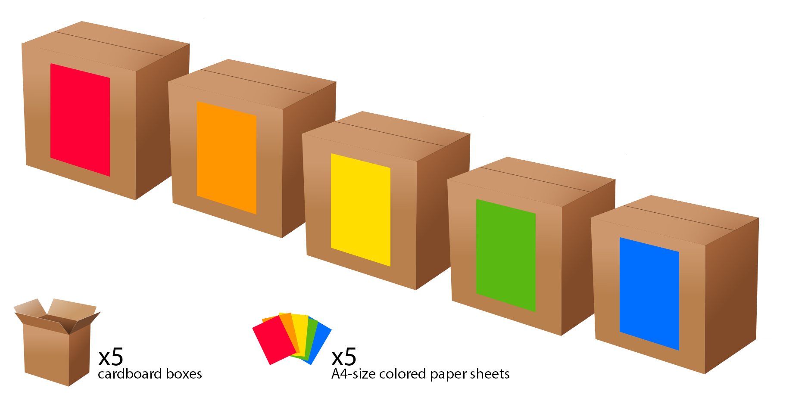
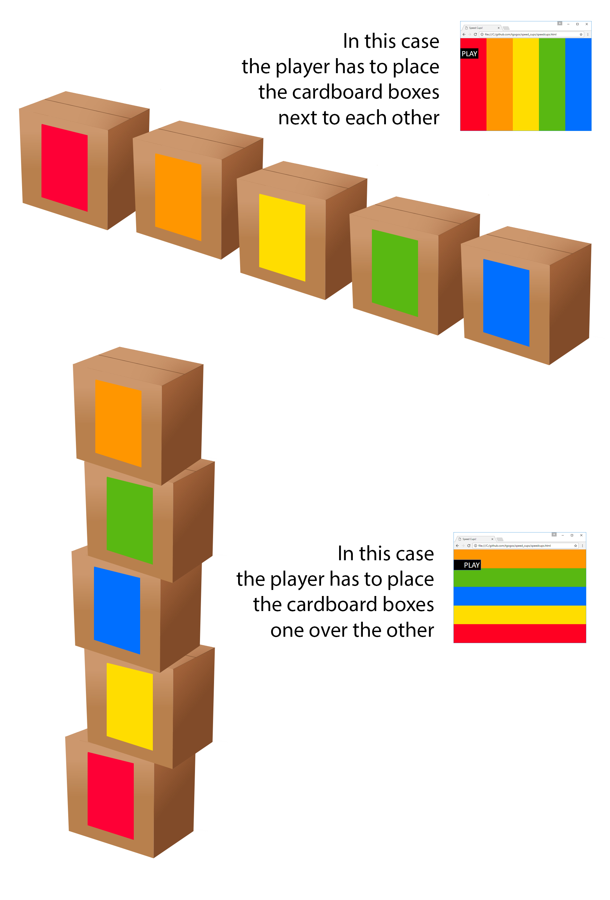

# Speed Cups
The idea is to play the famous board game "speed cups" but instead of small cups the player will be placing cardboard boxes on a big table or on the ground. A monitor or a projector should be used so that both players can see the color order.
 
## Build process
Here is an idea of what you may need...

## How to play
When the "Play" button is hit, the 5 colors randomly:
 - change their order and
 - take their place horizontally or vertically
 

